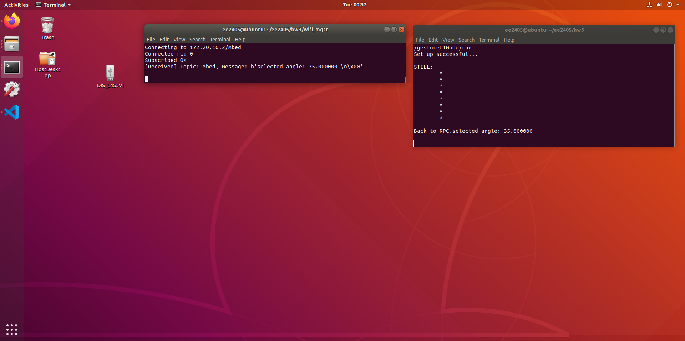
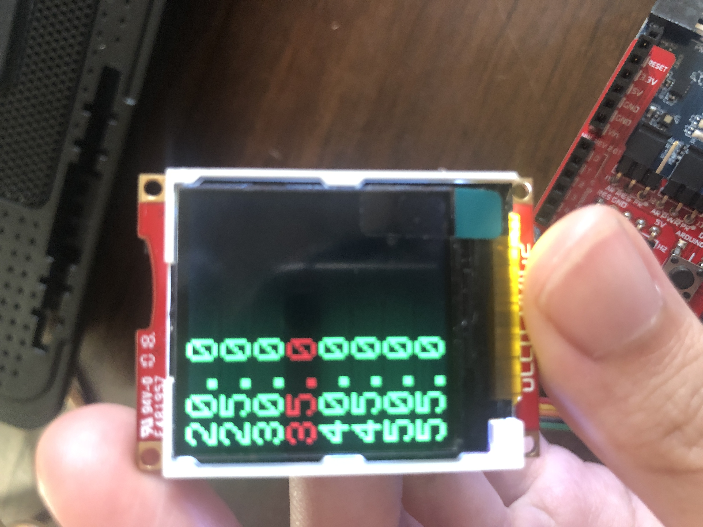
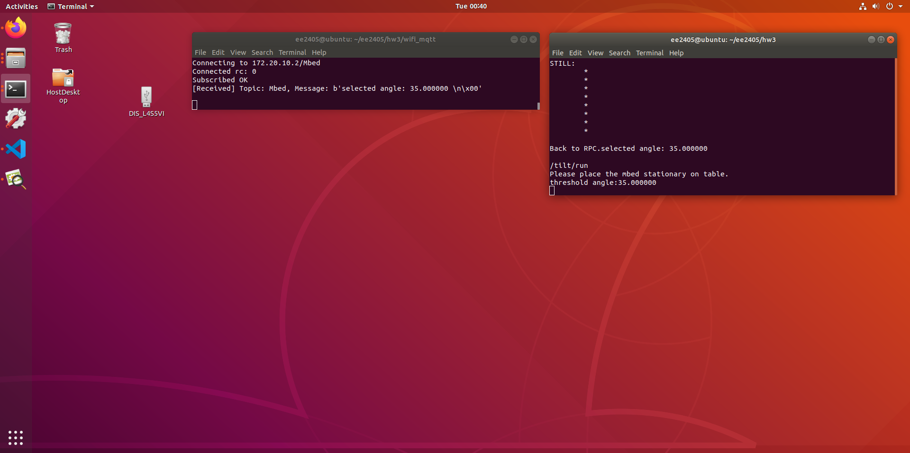

# hw3

## Setup and run the Program 

1. Compile mbed-os library

 `$ mkdir -p ~/ee2405new `
 
 `$ cp -r ~/ee2405/mbed-os ~/ee2405new`
 
 `$ cd ee2405new `
 
 `$ mbed compile --library --no-archive -t GCC_ARM -m B_L4S5I_IOT01A --build ~/ee2405new/mbed-os-build2 `
 
2. Move files and directories from mbed7,8,9,10
 - mbed_rpc
 - tensorflowlite_mbed
 - wifi_mqtt
 - accelerometer_handler.cpp
 - accelerometer_handler.h
 - BSP_B-L475E-IOT01.lib
 - config.h
 - magic_wand_model_data.cpp
 - magic_wand_model_data.h
 - mbed_app.json
 - mbed_rpc.lib
 - rpc_function.py
 - tensorflowlite_mbed.lib
 - tflite.json
 - wifi_mqtt.lib
 
3.Compile and run hw3 
 
 `$ sudo mbed compile --source . --source ~/ee2405new/mbed-os-build2/ -m B_L4S5I_IOT01A -t GCC_ARM -f ` 

4. Start a new terminal to execute python client.
  
  `$ sudo python3 wifi_mqtt/mqtt_client.py ` 
  
  ### - gesture UI mode

5. Using RPC command to send a command to call gesture UI mode.

`/gestureUIMode/run ` 

6. LED3(blue) to indicate the start of gesture UI mode.
7. User use gesture to select from threshold angles from a list of angles, 20, 25, 30, 35, 40, 45, 50, 55.
8. The selected threshold angle is published through WiFi/MQTT to a broker.

  ### - tilt angle detection mode

9. Using RPC over serial to send a command to call tilt angle detection mode.

`/tilt/run ` 

10. LED1(green) start blinking to indicate for a user to place the mbed on table.
11. LED1(green) stop blinking to indicate for a user to tilt the mbed. Screen will show the tilt angle on uLCD  every 1 seconds.
12. If tilt angle is over the selected threshold angle, mbed will publish the event and angle through WiFi/MQTT to a broker. 
13. After 10 tilt events, mbed is back to RPC loop.

## Results

  ### - Connecting and subscribe 
  
  
  
  ### - gesture UI mode
  
  1. RPC call gesture UI mode and using gesture to select angle
  
  
  
  2. MQTT message
  
  
  
  3. LED3(blue) to indicate the start of gesture UI mode
  
  
  
  4. the selection show on uLCD
  
  
  
  5. Back to RPC loop.
 
  

  ### - tilt angle detection mode
  
  1. RPC call RPC call tilt angle detection mode
  
  
  
  2. LED1(green) start blinking to indicate for a user to place the mbed on table.
  
  3. LED1(green) stop blinking to indicate for a user to tilt the mbed.
  
  
  
  4. Tilt angle show on uLCD  every 1 seconds denoted by blue..
  
  
  
  5. MQTT message 
  
  
  
  6. Back to RPC loop.
  
  

